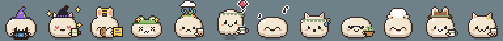
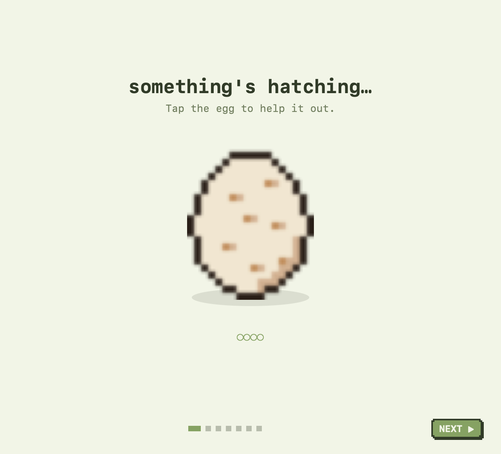
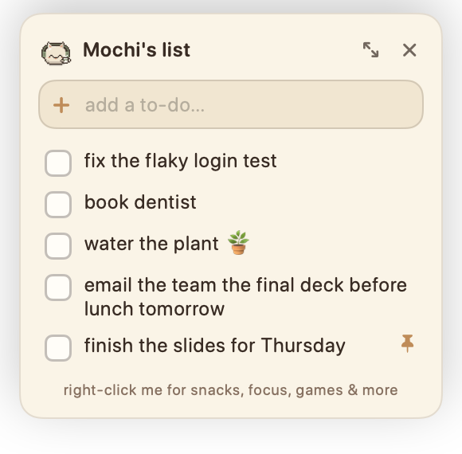
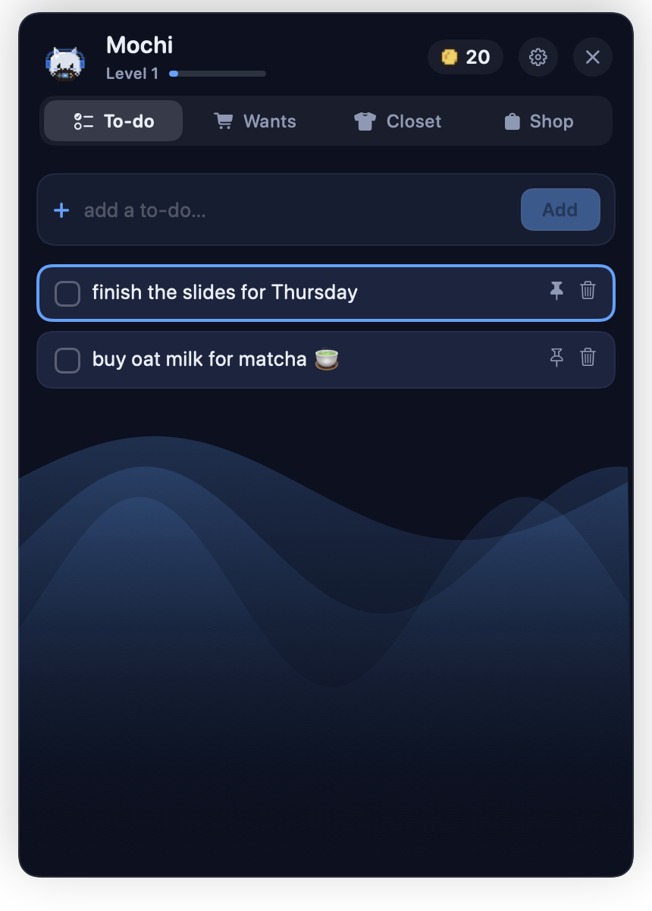
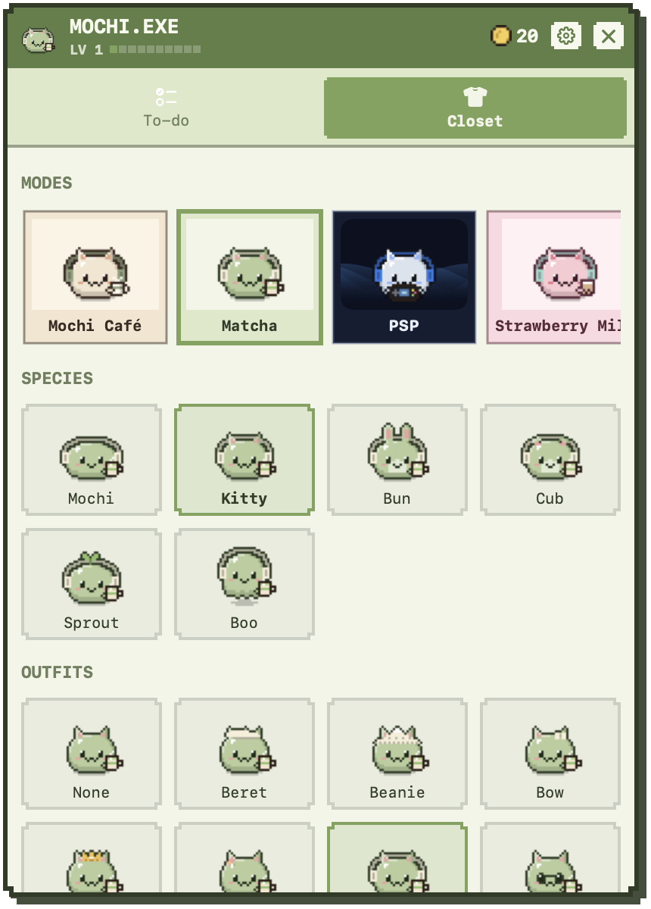
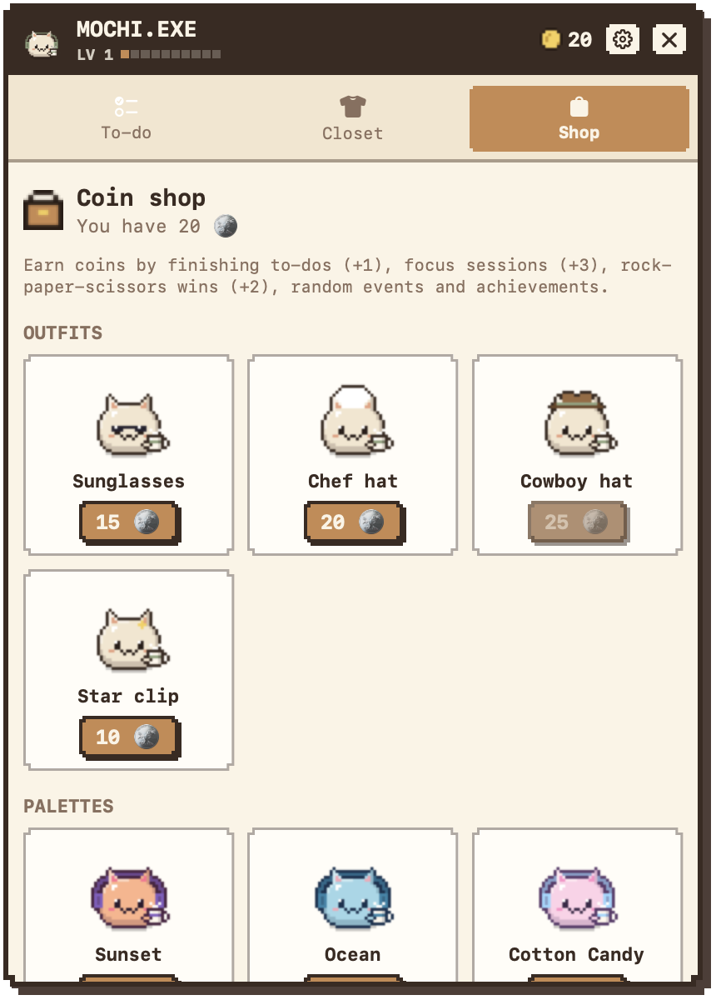
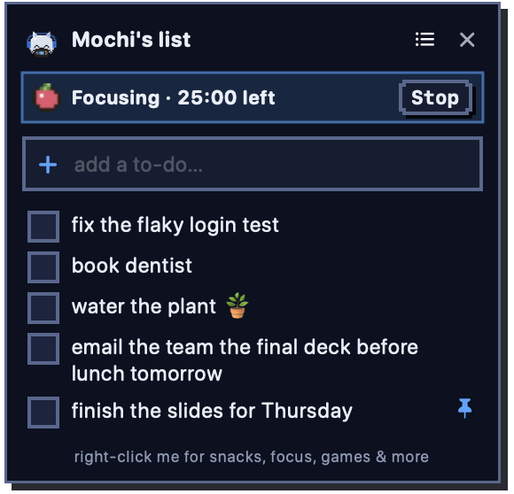
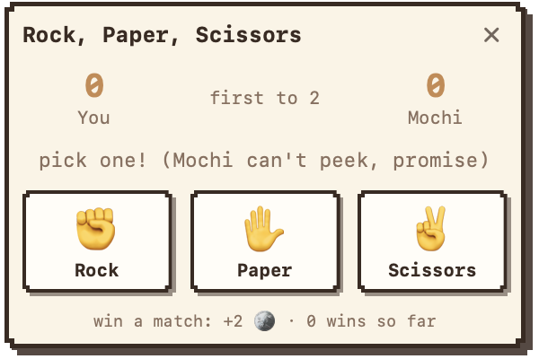
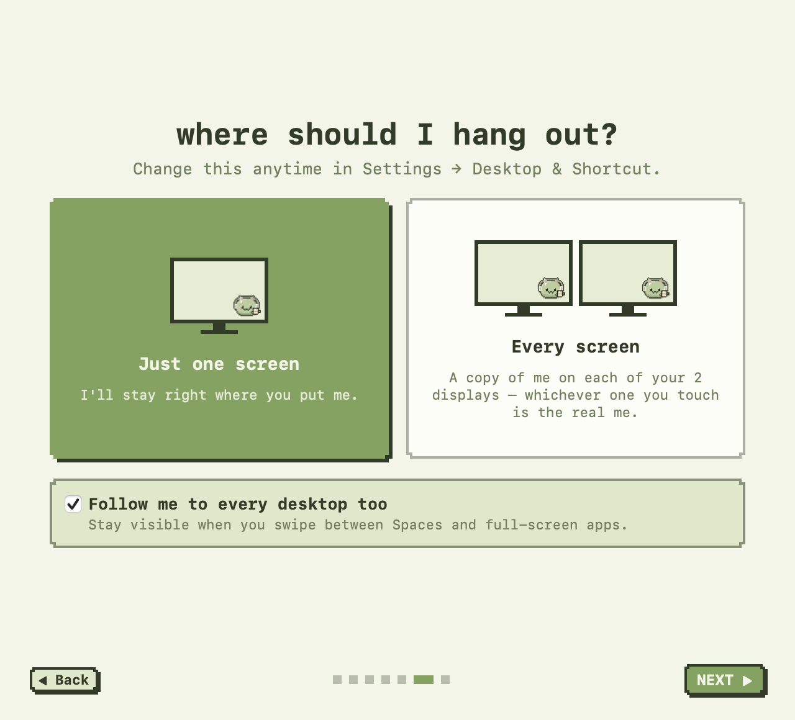

# Mochi — aesthetic pixel pets for your Mac 🍡

A tiny pixel creature that lives on your desktop. Click it to jot a to-do, right-click it to feed and play, dress it up, and let it cheer you on while you work.
Native SwiftUI + AppKit. Fully offline — no AI, no accounts, no network.

<p align="center">
  
</p>

## Download

**Homebrew** (easiest):

```bash
brew install --cask jeothecreator/mochi/mochi
```

**Or [⬇ download the DMG](https://github.com/jeothecreator/mochi/releases/latest)** — free, universal (Apple Silicon + Intel), macOS 14 Sonoma or newer.

**VS Code extension:** grab `mochi-pet-*.vsix` from the [latest release](https://github.com/jeothecreator/mochi/releases/latest), then `code --install-extension mochi-pet-1.1.0.vsix` (or Extensions → ⋯ → Install from VSIX…).

1. Open the DMG and drag **Mochi** into **Applications**.
2. Open Mochi. macOS will say it can't verify the developer — Mochi is free and not notarized by Apple.
3. Go to **System Settings → Privacy & Security**, scroll down and click **Open Anyway** next to Mochi. You only do this once (Homebrew installs need this too).
   <br>(Or in Terminal: `xattr -dr com.apple.quarantine /Applications/Mochi.app`)

Mochi lives in your **menu bar** (no Dock icon). Hatch your egg and say hi!

## Screenshots

| Hatch your pet | Quick to-do (left-click) | PSP mode | Closet |
|---|---|---|---|
|  |  |  |  |

| Coin shop | Focus timer | Rock, paper, scissors |
|---|---|---|
|  |  |  |

<p align="center"></p>

## Build from source

Requires **macOS 14+** (built on macOS 27 / Xcode 27 / Swift 6.4).

```bash
./scripts/build-app.sh      # → build/Mochi.app (release, universal, ad-hoc signed, pixel icon, mochi:// scheme)
open build/Mochi.app        # first launch: hatch your egg ✨
./scripts/make-dmg.sh       # → build/Mochi-<version>.dmg (set MOCHI_VERSION to change the version)
```

Mochi lives in the **menu bar** (no Dock icon). Copy it to `/Applications` if you want Launch at Login.

## What it does

| Do this | What happens |
|---|---|
| **Left-click** the pet | A little to-do box pops up beside it — type, press Return, tick things off. Esc or click the pet again to close. |
| **Right-click** the pet | Actions: stats line, Add a To-do, To-do List, **Focus ▸**, **Feed ▸**, **Play ▸** (zoomies, rock-paper-scissors), Head Pats, Nap / Wake, **Give ▸** treasures, Closet, Shop, Scrapbook, Hide, Settings |
| **Drag** it | Moves it; hover shows your pinned to-do |
| **⌃⌥⌘Space** | Summons the pet and opens the to-do box (changeable) |

**To-dos** — add from the quick box or the full list (right-click → To-do List). Check items off (+1 🪙 and a little celebration), pin one to see it when hovering the pet, clear finished ones. The pet occasionally nudges you about what's left.

**Focus timer (Pomodoro)** — right-click → Focus ▸ Start. Mochi pops on headphones and stays quiet (no chatter or random events), the countdown shows in the menu bar and the to-do box, and each finished session earns +3 🪙 and starts a break. Lengths are adjustable in Settings.

**Coin shop** — spend coins on sunglasses, a chef hat, a cowboy hat, a star clip, a tiny plant, and Sunset / Ocean / Cotton Candy / Golden ✨ palettes. Coins come from to-dos (+1), focus sessions (+3), rock-paper-scissors wins (+2), events and achievements.

**Rock, paper, scissors** — right-click → Play ▸. First to 2 wins; beat Mochi for +2 🪙.

**Pet life** — happiness, fullness and energy drift down slowly (never punishingly; it can't die). Feed it (cookie, onigiri, strawberry are free; matcha, boba, fish and cake cost coins), play, give head pats, send it to nap. Coins come from hanging out, finishing to-dos, events and achievements; friendship levels up as you interact.

**Home panel** — three tabs: *To-do*, *Closet* (modes, species, outfits, held items) and *Shop*. The *Scrapbook* (what it knows about you, 23 achievements, memories) lives in Settings.

**Modes** — Mochi Café, **Matcha**, **PSP** (piano black, glowing waves, rounded type, pet plays a handheld), Strawberry Milk, Pocket (4-shade green), Midnight, Terminal. A mode sets the theme + palette + held item; tweak anything after.

**Customize** — 6 species, 14 outfits (4 secret), 6 held items (incl. matcha latte, notepad, handheld), 4 eye styles, 11 palettes + custom colors, size 64–256 pt, CRT scanlines, liveliness.

**Brain (no AI)** — rules, timers and dice:
- Watches your cursor; naps when your Mac is idle; jumps awake when your cursor comes near.
- Knows which *kind* of app is in front (coding, slides, Canva/design, writing, studying, gaming, video, music), dresses for the task, cheers you on, and nudges breaks at 1/2/3/5 hours.
- Says little things based on time of day, your profile, pinned notes, and **memories** ("remember when you spent 3 hours coding in one day? 💻"). Chattiness: Quiet / Sometimes / Chatty.
- **Random events** rolled each active minute — common 1/10 (finds a cookie, sneezes, naps, investigates your cursor, dance break), uncommon 1/50 (coin, balloon float, ladybug crawls by), rare 1/250 (golden fish swims across, ghost, a visitor pet, indoor rain), legendary 1/1000 (mystery package).
- **Secrets** — 100 pokes, 500 pokes, 10 cookies in a day, 3 AM, gone 30 min, gone a day, typing its name, giving it something golden… (see the Scrapbook for hints).

**VS Code** — the [Mochi extension](vscode-extension) makes the pet worry when a save leaves errors, celebrate when they're all fixed, and cheer/faint when build or test tasks finish. No shell setup needed.

**Reacts to your builds (any terminal)** — Settings → *Personality & Senses* has a zsh hook and git hook to copy. Anything that can open a URL works:

```bash
open -g "mochi://build?status=0"   # ✨ celebrates   (status≠0 → 💥 falls over)
open -g "mochi://commit"           # 💃 dances
```

## Onboarding

Hatch an egg (tap it!) → name your pet → tell it about you (name, favorite color, games, birthday) → pick what you do on your laptop (coding, slides, Canva, …) → pick a mode → choose **one screen or every screen** (plus “follow me to every desktop/Space”) → tips. All editable later.

**Every screen:** one pet per display, animating in sync. Hovering or clicking any of them quietly swaps it with the main pet, so the to-do box, bubbles and menus open on the display you’re using. Each copy can be dragged to its own spot (remembered per display).

## Privacy

- **Senses**: cursor position, seconds since last input, and the frontmost app's identity. **Never** keystrokes (the secret word only counts inside Mochi's own text fields), window titles, or screen contents. No Accessibility / Input Monitoring / Screen Recording permissions.
- **Stored locally**: prefs in UserDefaults (`com.mochi.desktoppet`); pet life, to-dos and memories in `~/Library/Application Support/Mochi/pet.json` (older save files upgrade automatically).
- No accounts, analytics, or network access at all. Reset everything: Settings → Personality & Senses → *Reset pet & re-hatch*.

## Developer tools

```bash
swift build && .build/debug/Mochi --self-test        # hotkeys, pet rules, to-dos, build hooks, secrets, save-file upgrades
.build/debug/Mochi --render-previews /tmp/sheet.png   # every species × outfit, poses, palettes
.build/debug/Mochi --render-zoom /tmp/zoom.png        # new outfits/expressions/effects up close
.build/debug/Mochi --render-ui /tmp/ui                # offscreen PNGs at exact size (clipping shows): home tabs × modes, quick box, bubbles, settings, onboarding
open --env MOCHI_TEST_PROFILE=1 --env MOCHI_SHOW_IN_DOCK=1 build/Mochi.app   # sandboxed prefs + data, visible to UI-test tools
```

Test/snapshot runs write to temp folders, never your real pet.

## Layout

| File | What |
|---|---|
| `Sprite.swift`, `PixelIcons.swift`, `Palette.swift` | Procedural pixel art: creatures, outfits, props, effects, icons, palettes |
| `PetBrain.swift` | Frame-by-frame pose from state (acts, sleep, cursor, idle behaviors) |
| `Director.swift` | Rule-based brain: senses → moods, lines, events, secrets, build reactions |
| `Senses.swift` | Cursor / idle / frontmost-app polling (2 Hz) |
| `PetLife.swift` | Stats, food, treasures, achievements, notes, memories, profile (JSON) |
| `PetWindow.swift`, `Overlays.swift` | Desktop pet window, speech bubble, critter layer, mystery package |
| `Popovers.swift` | Pop-ups next to the pet: quick to-do + focus countdown, rock-paper-scissors |
| `vscode-extension/` | VS Code extension (plain JS, no dependencies) |
| `HomeView.swift`, `OnboardingView.swift`, `SettingsView.swift` | To-do / Closet panel, onboarding, settings (incl. Scrapbook) |

## Performance

The pet redraws at most 10×/s and only when its frame changes; senses poll at 2 Hz; critter and wave animations run only while visible. Stat/activity bookkeeping is batched so the UI isn't redrawn by background ticks.

## Known limitations

- Shortcut clashes with *other* apps can't be detected by macOS's hot-key API.
- App detection is by bundle ID; browser-based tools (Google Slides, web Canva) show up as your browser, not as slides/design.

## License

[MIT](LICENSE) — free to use, modify and share.
